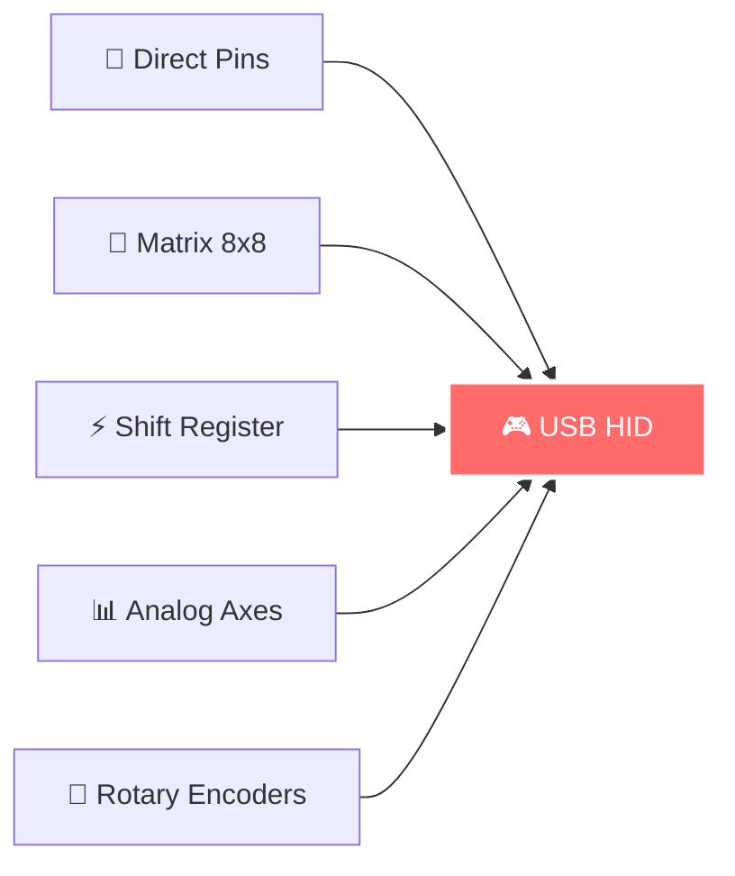

# 🎮 JoyCore-FW
> **Next-Generation USB Game Controller Firmware for RP2040**

<div align="center">


**⚠️ RP2040 Native Branch - For Arduino Pro Micro see [`main`](../../tree/main) | For Teensy 4.0 see [`teensy40`](../../tree/teensy40)**

</div>

---

## ✨ **Why RP2040?**

<table>
<tr>
<td width="50%">

### 🚀 **Performance**
- **Dual ARM Cortex-M0+** @ 133MHz
- **264KB SRAM** + 2MB Flash  
- **Hardware PIO** for accelerated I/O
- **<2ms button response** time

</td>
<td width="50%">

### 💰 **Economics** 
- **~$4-8** vs $20+ alternatives
- **Wide board support** (Pico, Feather, etc.)
- **Native USB-C** on most boards
- **Professional reliability**

</td>
</tr>
</table>

---

## 🛠 **Features at a Glance**



| Input Type | Description | Max Count |
|------------|-------------|-----------|
| 🎯 **Direct Pins** | Individual button/encoder pins | ~26 pins |  
| 🔘 **Matrix Scanning** | Row/column multiplexing | 64 buttons (8×8) |
| ⚡ **Shift Registers** | 74HC165 expansion | 128+ inputs |
| 📊 **Analog Axes** | Built-in ADC + ADS1115 | 8 axes |
| 🔄 **Encoders** | All input types supported | Unlimited |

---

## 🚀 **Quick Start**

### ⚡ **1. Hardware Setup**

> **⚠️ CRITICAL:** RP2040 pins are **3.3V only** - use level shifters for 5V devices!

Configure your pin mapping in `src/config/ConfigDigital.h`:

```cpp
static const PinMapEntry hardwarePinMap[] = {
  // 🎯 Direct inputs
  {"2", BTN},           // Simple button
  {"3", BTN},           // Another button  
  
  // 🔄 Direct encoder
  {"9", BTN},           // Encoder A channel
  {"10", BTN},          // Encoder B channel
  
  // 🔘 3×2 Matrix
  {"4", BTN_ROW},       // Matrix row 0
  {"5", BTN_ROW},       // Matrix row 1  
  {"6", BTN_ROW},       // Matrix row 2
  {"7", BTN_COL},       // Matrix column 0
  {"8", BTN_COL},       // Matrix column 1
  
  // ⚡ 74HC165 Shift Register
  {"18", SHIFTREG_CLK}, // Clock pin
  {"19", SHIFTREG_PL},  // Parallel load pin
  {"20", SHIFTREG_QH}   // Serial data out pin
};
```

### 🎮 **2. Configure Inputs**

Map your hardware to joystick buttons in the same file:

<details>
<summary><b>📂 Complete Input Configuration</b></summary>

```cpp
constexpr LogicalInput logicalInputs[] = {
  // 🎯 Direct pin buttons
  { INPUT_PIN, { .pin = {2, 1, NORMAL, 0} } },      // Pin 2 → Button 1
  { INPUT_PIN, { .pin = {3, 2, MOMENTARY, 0} } },   // Pin 3 → Button 2 (momentary)
  
  // 🔄 Direct pin encoder (consecutive ENC_A → ENC_B)
  { INPUT_PIN, { .pin = {9, 3, ENC_A, 0} }, FOUR3 }, // Pin 9 → Encoder A
  { INPUT_PIN, { .pin = {10, 4, ENC_B, 0} }, FOUR3 }, // Pin 10 → Encoder B
  
  // 🔘 Matrix buttons (3×2 = 6 buttons)
  { INPUT_MATRIX, { .matrix = {0, 0, 5, NORMAL, 0} } },    // Row 0, Col 0 → Button 5
  { INPUT_MATRIX, { .matrix = {0, 1, 6, NORMAL, 0} } },    // Row 0, Col 1 → Button 6
  { INPUT_MATRIX, { .matrix = {1, 0, 7, MOMENTARY, 0} } }, // Row 1, Col 0 → Button 7
  { INPUT_MATRIX, { .matrix = {1, 1, 8, NORMAL, 0} } },    // Row 1, Col 1 → Button 8
  
  // 🔄 Matrix encoder (uses positions 2,0 and 2,1)
  { INPUT_MATRIX, { .matrix = {2, 0, 9, ENC_A, 0} }, FOUR0 }, // Row 2, Col 0 → Encoder A
  { INPUT_MATRIX, { .matrix = {2, 1, 10, ENC_B, 0} }, FOUR0 }, // Row 2, Col 1 → Encoder B
  
  // ⚡ Shift register inputs
  { INPUT_SHIFTREG, { .shiftreg = {0, 0, 11, NORMAL, 0} } },     // Reg 0, bit 0 → Button 11
  { INPUT_SHIFTREG, { .shiftreg = {0, 1, 12, MOMENTARY, 0} } }, // Reg 0, bit 1 → Button 12
  
  // 🔄 Shift register encoder (consecutive bits 2 & 3)
  { INPUT_SHIFTREG, { .shiftreg = {0, 2, 13, ENC_A, 0} }, FOUR0 }, // Reg 0, bit 2 → Encoder A
  { INPUT_SHIFTREG, { .shiftreg = {0, 3, 14, ENC_B, 0} }, FOUR0 }  // Reg 0, bit 3 → Encoder B
};
```

</details>

### 🔧 **3. Build & Flash**

```bash
# 🏗️ Build firmware
pio run

# 📱 Flash to RP2040 (hold BOOTSEL button while plugging USB)
pio run --target upload
```

---

## ⚙️ **Digital Input Configuration**

### 🎛️ **Button Behaviors**

| Type | Description | Use Case |
|------|-------------|----------|
| `NORMAL` | Standard press/release | Fire buttons, gear switches |
| `MOMENTARY` | Quick pulse on press | Toggle commands, mode switches |
| `ENC_A/ENC_B` | Encoder channels (paired) | Rotary controls, scroll wheels |

### 🔄 **Encoder Setup & Advanced Tips**

> **💡 Pro Tip:** Encoders require consecutive ENC_A → ENC_B entries with matching latch modes

```cpp
// ✅ Correct encoder pairing
{ INPUT_PIN, { .pin = {9, 1, ENC_A, 0} }, FOUR3 },  // A channel
{ INPUT_PIN, { .pin = {10, 2, ENC_B, 0} }, FOUR3 }, // B channel (same latch mode)

// ❌ Wrong - different latch modes
{ INPUT_PIN, { .pin = {9, 1, ENC_A, 0} }, FOUR3 },  // A channel  
{ INPUT_PIN, { .pin = {10, 2, ENC_B, 0} }, FOUR0 }, // B channel (different mode!)
```

**Latch Modes:**
- `FOUR3` - 4 steps/detent, both edges (most common)
- `FOUR0` - 4 steps/detent, single edge  
- `TWO03` - 2 steps/detent (fast response)

**Encoder Placement Strategies:**
- **Direct Pins**: Best performance, use for primary controls
- **Matrix**: Good for secondary encoders, shares pins efficiently  
- **Shift Register**: Lowest cost, slight latency increase

---

## 📊 **Analog Axis Configuration & Processing**

### 🎮 **Basic Axis Setup**

Configure analog inputs in `src/config/ConfigAxis.h`:

```cpp
// 📊 X-Axis (Built-in ADC)
#define USE_AXIS_X
#ifdef USE_AXIS_X
    #define AXIS_X_PIN              A0              // Built-in 12-bit ADC
    #define AXIS_X_MIN              0               
    #define AXIS_X_MAX              32767           
    #define AXIS_X_FILTER_LEVEL     AXIS_FILTER_EWMA // Smart filtering
    #define AXIS_X_EWMA_ALPHA       200             // Responsiveness (0-1000)
    #define AXIS_X_DEADBAND         250             // Anti-jitter
    #define AXIS_X_CURVE            CURVE_LINEAR    // Response curve
#endif

// 📊 Y-Axis (High-Resolution with ADS1115)
#define USE_AXIS_Y  
#ifdef USE_AXIS_Y
    #define AXIS_Y_PIN              ADS1115_CH0     // 16-bit external ADC
    #define AXIS_Y_MIN              0
    #define AXIS_Y_MAX              32767
    #define AXIS_Y_FILTER_LEVEL     AXIS_FILTER_EWMA
    #define AXIS_Y_EWMA_ALPHA       150
    #define AXIS_Y_CURVE            CURVE_S_CURVE   // Smooth center response
#endif
```

**Hardware Options:**
- **Built-in ADC**: A0, A1, A2 (GPIO26-28) - 12-bit resolution
- **ADS1115**: ADS1115_CH0 to ADS1115_CH3 - 16-bit resolution, I2C interface

### 📈 **Signal Processing Pipeline**

```
🔄 Raw Input → 🎯 Deadband → 🔬 Noise Filter → ⚡ EWMA Smoothing → 📊 Response Curve → 🎮 USB Output
```

### 🔬 **Advanced Filtering Options**

| Filter | Description | Best For |
|--------|-------------|----------|
| `AXIS_FILTER_OFF` | Raw values | High-precision, low-noise sensors |
| `AXIS_FILTER_EWMA` | Exponential smoothing | General use, configurable response |

**EWMA Alpha Values:**
- `30-50` - Heavy smoothing (slow, stable)
- `100-200` - Balanced (recommended) 
- `300-500` - Light smoothing (fast, responsive)

**Response Curves:**
- `CURVE_LINEAR` - Direct 1:1 response
- `CURVE_S_CURVE` - Gentle center, steep edges (flight sticks)
- `CURVE_EXPONENTIAL` - Progressive response (throttles)
- `CURVE_CUSTOM` - Define your own lookup table

**Intelligent Deadband:**
- Dynamic around current position (not fixed center)
- Prevents jitter when control is at rest
- Statistical analysis avoids interfering with slow movements
- Typical values: 0 (off), 250-500 (light), 500-1000 (medium)

---

## 🔌 **USB & System Configuration**

### 📱 **USB Descriptor Configuration**

Customize your device identity in `src/config/ConfigDigital.h`:

```cpp
static const struct {
    uint16_t vendorID;
    uint16_t productID; 
    const char* manufacturer;
    const char* product;
} staticUSBDescriptor = {
    .vendorID = 0x2E8A,          // Raspberry Pi Foundation
    .productID = 0xA02F,         // Custom PID
    .manufacturer = "YourName",   // 🏷️ Your brand
    .product = "Epic Controller"  // 🎮 Your product
};
```

### 🎛️ **Configuration Modes**

| Mode | Description | Use Case |
|------|-------------|----------|
| `CONFIG_MODE_STATIC` | Compile-time config | Development, simple setups |
| `CONFIG_MODE_STORAGE` | Runtime config via HID/Serial | Production, end-user config |
| `CONFIG_MODE_HYBRID` | Static fallback + storage | Best of both worlds |

---

## 🔧 **Hardware Compatibility**

<table>
<tr>
<td width="33%">

### 🍓 **Raspberry Pi Pico**
- GPIO0-28 available
- Built-in LED on GPIO25
- USB-C connector
- **$4-6**

</td>
<td width="33%">

### 🦅 **Adafruit Feather RP2040**  
- GPIO0-29 available
- NeoPixel + user button
- USB-C + JST battery
- **$10-12**

</td>
<td width="33%">

### ⚡ **SparkFun Pro Micro RP2040**
- Arduino Pro Micro footprint
- GPIO0-29 available  
- USB-C connector
- **$8-10**

</td>
</tr>
</table>

---

## 🏆 **Performance Comparison**

| Metric | Arduino Pro Micro | Teensy 4.0 | **RP2040** |
|--------|------------------|------------|-------------|
| **CPU** | 16MHz ATmega32U4 | 600MHz ARM M7 | **133MHz ARM M0+** |
| **RAM** | 2.5KB | 512KB | **264KB** |  
| **Flash** | 32KB | 1MB | **2MB** |
| **Response** | ~10ms | <1ms | **<2ms** |
| **Cost** | $8-12 | $20-25 | **$4-8** |
| **USB** | Unstable | Excellent | **Excellent** |

---

## 📚 **Dependencies**

```ini
[env:rp2040]
platform = raspberrypi
framework = arduino
board_build.core = earlephilhower

lib_deps = 
    adafruit/Adafruit ADS1X15@^2.5.0  # 16-bit ADC support
```

---

## 🆘 **Troubleshooting**

<details>
<summary><b>🔧 Common Issues & Solutions</b></summary>

### **Upload Issues**
- Hold **BOOTSEL** button while connecting USB
- Check cable supports data (not just power)
- Verify correct COM port in device manager

### **Pin Problems** 
- RP2040 is **3.3V only** - use level shifters for 5V
- Analog pins: Only A0, A1, A2 (GPIO26-28) available on RP2040
- Use ADS1115 for additional analog inputs

### **Configuration Errors**
- Encoder pairs must be consecutive ENC_A → ENC_B entries
- Matrix dimensions must match row/col pin counts
- Shift register count must match chained 74HC165 chips

</details>

---

## 🌟 **Credits**

<table>
<tr>
<td align="center" width="25%">
<br>
<b>Raspberry Pi Foundation</b><br>
<sub>RP2040 MCU</sub>
</td>
<td align="center" width="25%">
<br>
<b>Earle Philhower</b><br>
<sub>Arduino-Pico Core</sub>
</td>
<td align="center" width="25%">
<br>
<b>Ha Thach</b><br>
<sub>TinyUSB Stack</sub>
</td>
<td align="center" width="25%">
<br>
<b>Adafruit</b><br>
<sub>ADS1X15 Library</sub>
</td>
</tr>
</table>

---

<div align="center">

**⭐ Star this repo if it powers your awesome controller builds! ⭐**

[](../../stargazers)
[](../../network/members)

</div>