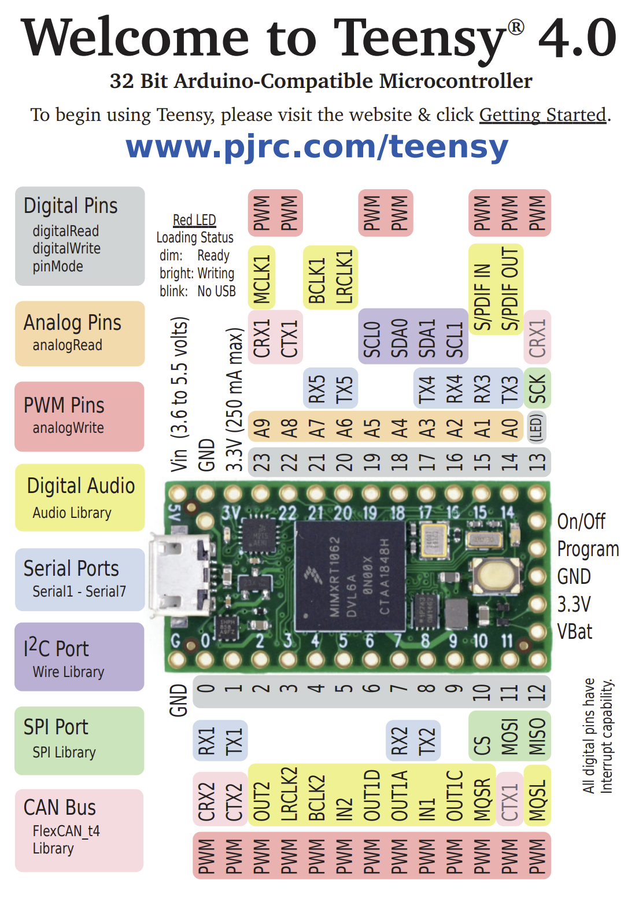

# JoyCore-FW

## Teensy 4.0 Port

**⚠️ This is the Teensy 4.0 port branch - for the original Arduino Pro Micro version, see the `main` branch.**

**Teensy 4.0-based** USB game controller firmware. This port uses Teensy 4.0's USB HID capabilities and supports matrix buttons, rotary encoders, direct pin buttons, shift register inputs, and analog axes.

### Advantages of Teensy 4.0 Port

✅ **USB Performance**: Native USB HID implementation

✅ **Simplified Architecture**: No need for complex DynamicHID implementation

✅ **Processing Power**: 600MHz ARM Cortex-M7 vs 16MHz ATmega32U4

✅ **Memory**: 1MB Flash + 512KB RAM vs 32KB Flash + 2.5KB RAM

✅ **I/O Pins**: More pins available for button matrices and encoders

### Hardware Requirements

- **Teensy 4.0** (not compatible with Arduino Pro Micro/Leonardo)
- Compatible with all existing button box hardware designs
- Same pin mapping concepts apply

#### Teensy 4.0 Pinout Reference



Use this pinout reference when configuring your hardware connections in `src/ConfigDigital.h`.

---

## Features

- **Matrix Button Scanning**: Row/column multiplexing for button arrays
- **Rotary Encoders**: Direct pin, matrix, and shift register-based encoders
- **Shift Registers**: Expand inputs with [74HC165](https://www.ti.com/lit/ds/symlink/sn74hc165.pdf) chips
- **Analog Inputs**: Built-in analog pins and ADS1115 16-bit ADC support
- **USB HID Game Controller**: Native USB interface via Teensy's joystick library
- **Signal Processing**: Configurable noise filtering and response curves for analog axes
- **Configuration**: Same format as Arduino version

---

## Quick Start

### 1. Hardware Setup

Connect your Teensy 4.0 and configure the pin mapping in `src/ConfigDigital.h`:

```cpp
static const PinMapEntry hardwarePinMap[] = {
  {"2", BTN_ROW},         // Matrix row
  {"3", BTN_ROW},
  {"4", BTN_ROW},
  {"5", BTN_ROW},
  {"6", BTN_COL},         // Matrix column
  {"16", SHIFTREG_QH},    // 74HC165 QH (serial out)
  {"14", SHIFTREG_PL},    // 74HC165 PL (parallel load)
  {"15", SHIFTREG_CLK}    // 74HC165 CLK (clock)
};
```

### 2. Configure Inputs

Define your logical inputs in `src/ConfigDigital.h`:

```cpp
constexpr LogicalInput logicalInputs[] = {
  // Matrix buttons
  { INPUT_MATRIX, { .matrix = {0, 0, 1, NORMAL} } },
  { INPUT_MATRIX, { .matrix = {1, 0, 2, NORMAL} } },
  
  // Matrix encoders
  { INPUT_MATRIX, { .matrix = {2, 0, 3, ENC_A} } },
  { INPUT_MATRIX, { .matrix = {3, 0, 4, ENC_B} } },
  
  // Shift register inputs
  { INPUT_SHIFTREG, { .shiftreg = {0, 0, 5, NORMAL} } }
};
```

### 3. Configure Analog Axes

Set up analog axes in `src/ConfigAxis.h`:

```cpp
// Built-in analog pin
#define AXIS_X_PIN A0

// ADS1115 channel
#define AXIS_X_PIN ADS1115_CH0  // 16-bit resolution
```

---

## 📋 Configuration Guide

### Hardware Pin Mapping

Edit `src/ConfigDigital.h` to match your hardware. Each entry defines a pin and its function:

**Pin Types:**
- `BTN_ROW`, `BTN_COL`: For matrix scanning
- `SHIFTREG_PL`, `SHIFTREG_CLK`, `SHIFTREG_QH`: For shift register chips
- `BTN`: For direct-wired buttons

### Teensy 4.0 Pin Considerations

Teensy 4.0 has different pin numbering than Arduino Pro Micro:

| Feature | Arduino Pro Micro | Teensy 4.0 | Notes |
|---------|------------------|------------|-------|
| Digital I/O | 0-21 | 0-23, 24-33 | More pins available |
| Analog Input | A0-A3, A6-A10 | A0-A13 | More analog inputs |
| PWM | Limited | Many pins | PWM support |
| Interrupts | 2, 3, 7 | Most pins | Interrupt options |
| I2C | 2, 3 | 18, 19 | For ADS1115 ADC |

### Shift Register Configuration

Set the number of chained 74HC165 chips:

```cpp
#define SHIFTREG_COUNT    1  // Number of 74HC165 chips
```

### Analog Axis Configuration

Configure analog axes in `src/ConfigAxis.h`. You can use built-in analog pins or ADS1115 channels:

**ADS1115 Channels:**
- `ADS1115_CH0` - Channel 0 (pins 0-1)
- `ADS1115_CH1` - Channel 1 (pins 2-3) 
- `ADS1115_CH2` - Channel 2 (pins 4-5)
- `ADS1115_CH3` - Channel 3 (pins 6-7)

**ADS1115 Wiring:**
- SDA → Pin 18 (Teensy 4.0)
- SCL → Pin 19 (Teensy 4.0)
- VCC → 3.3V
- GND → GND

The ADS1115 is automatically initialized when any axis uses ADS1115 channels.

**Filter Options:**
- `AXIS_FILTER_OFF` - No filtering (raw values)
- `AXIS_FILTER_LOW` - Light filtering
- `AXIS_FILTER_MEDIUM` - Moderate filtering (default)
- `AXIS_FILTER_HIGH` - Heavy filtering

**Response Curves:**
- `CURVE_LINEAR` - Linear response (1:1 mapping)
- `CURVE_S_CURVE` - S-curve (gentle at center, steeper at edges)
- `CURVE_EXPONENTIAL` - Exponential (gentle at start, steep at end)
- `CURVE_CUSTOM` - Custom curve (define your own)

### Logical Inputs

Define your logical inputs in the `logicalInputs` array:

**Behavior options:**
- `NORMAL`: Standard button (press/release)
- `MOMENTARY`: Sends a quick pulse on press
- `ENC_A`, `ENC_B`: Used for rotary encoder channels (must be paired as A/B)

### 4. Build & Upload

```bash
# Build the project
pio run

# Upload to Teensy 4.0
pio run --target upload
```

---

## 🔧 Technical Differences Between Branches

### USB Implementation
- **Arduino Leonardo (main branch)**: Uses custom DynamicHID implementation with PluggableUSB
- **Teensy 4.0 (this branch)**: Uses native Teensyduino joystick library

### Performance Comparison

| Metric | Arduino Pro Micro | Teensy 4.0 | Improvement |
|--------|------------------|------------|-------------|
| CPU Speed | 16MHz ATmega32U4 | 600MHz ARM Cortex-M7 | 37x faster |
| Memory | 32KB Flash + 2.5KB RAM | 1MB Flash + 512KB RAM | 32x more |
| Loop Speed | ~1kHz typical | >10kHz possible | 10x+ faster |
| Button Response | <10ms | <1ms | 10x+ faster |
| USB Latency | Variable | Consistent | More consistent |

### USB Descriptors
- **Arduino Leonardo**: Custom USB HID descriptors required
- **Teensy 4.0**: Automatic USB descriptor generation

### Reliability
- **Arduino Leonardo**: Occasional USB enumeration issues
- **Teensy 4.0**: Stable USB implementation with better host compatibility

---

## 🔄 Migration Between Branches

### From Arduino Pro Micro to Teensy 4.0

1. **Hardware**: Replace Arduino Pro Micro/Leonardo with Teensy 4.0
2. **Pin mapping**: Update pin numbers in `ConfigDigital.h` for Teensy 4.0 layout
3. **Voltage levels**: Ensure 3.3V compatibility (most components work fine)
4. **Upload**: Use Teensy Loader or PlatformIO Teensy platform
5. **Performance**: Better USB stability and performance

### Configuration Compatibility

✅ **Same configuration format**: `ConfigAxis.h` and `ConfigDigital.h` work identically  
✅ **Same ADS1115 support**: Same channel definitions and automatic initialization  
✅ **Same axis processing**: Identical filtering and curve algorithms  
✅ **Same logical input structure**: Matrix, direct pin, and shift register configurations  

The configuration format remains the same - only the hardware platform changes.

### Configuration Utility Compatibility (**FUTURE**)

A configuration utility would work with both branches because:
- Same configuration format and structure
- Same ADS1115 channel definitions (`ADS1115_CH0-3`)
- Same axis processing logic and filter options
- Same pin assignment system

---

## Dependencies

- **PlatformIO**: Development platform
- **Teensy 4.0**: Target hardware
- **Teensyduino**: Arduino-compatible framework for Teensy (included with PlatformIO Teensy platform)
- **Adafruit ADS1X15**: For analog input support

---

## Credit

- **[Teensy](https://www.pjrc.com/)** - Microcontroller with USB support
- **[RotaryEncoder Library](https://github.com/mathertel/RotaryEncoder)** - Modified and integrated
- **[Keypad Library](https://playground.arduino.cc/Code/Keypad/)** - Replaced with built-in implementation

Thanks to PJRC for creating Teensy and its USB implementation. The original Arduino Leonardo version was based on the Arduino Joystick Library and related components.

---

## Troubleshooting

### Common Issues
1. **Pin numbering**: Teensy 4.0 uses different pin numbers than Arduino Pro Micro
2. **Voltage levels**: Ensure 3.3V compatibility of your components
3. **USB type**: Use `USB_SERIAL_HID` build flag for development

### Debug Options
- **Serial Monitor**: Available for debugging
- **USB Descriptor**: Automatically handled by Teensy
- **LED Indicator**: Use built-in LED for status indication

---

## Tips

- Use unique joystick button IDs for each input
- For encoders, always define A and B channels as consecutive entries
- You can mix matrix, direct, and shift register inputs freely
- Teensy 4.0's 3.3V logic is compatible with most 5V devices (check your specific components)
- The ADS1115 provides 16-bit resolution vs 10-bit for built-in analog pins
- Configuration is identical between branches - only hardware platform differs